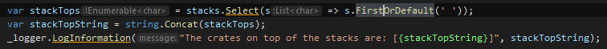
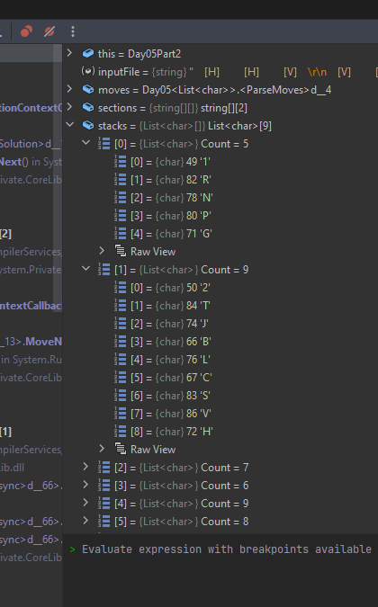
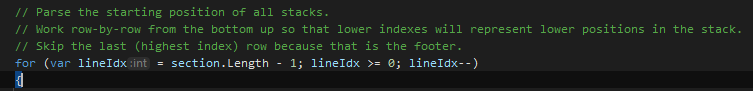

# Day 5: Supply Stacks

When you get the wrong answer from an AoC solution, its usually in one of two places:
1. The parsing code
2. The actual problem logic

Today, I spent forever searching those two areas for a bug that turned out to be somewhere else entirely.
Did you know that if you accidentally read the **bottom** of the stacks instead of the top, then you'll get the wrong answer?
Who could have guessed.

On the plus side, that led me to discover that the solution will still work even if you accidentally include the stack numbers in the stacks:

 

That was supposed to be `section.Length - 2` in order to skip the last row.
Everything still worked with the extra crates, I assume because it "lifted" each stack by an equal amount.

